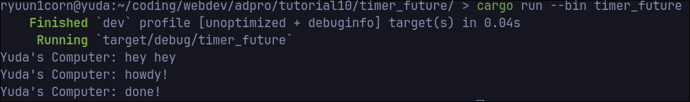
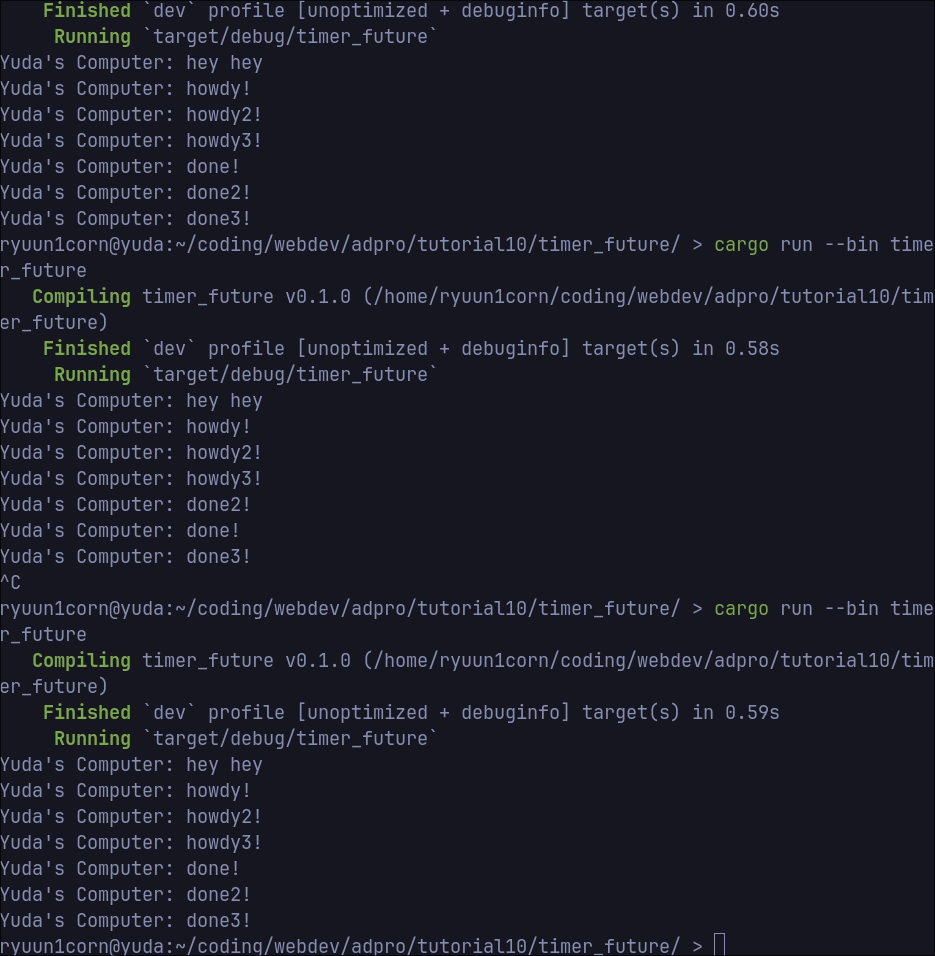

# Tutorial 10

## Experiment 1.2: Understanding how it works

Dapat dilihat bahwa print yang terletak di paling bawah adalah print yang paling pertama muncul. Hal ini dikarenakan ketika melakukan spawner.spawn, program hanya akan menjadwalkan task tersebut, tetapi tidak secara langsung melakukannya. Task hanya akan dilakukan jika sudah dipanggil oleh executor.run() yang letaknya di bawah print terakhir. Oleh karena itu, kedua print yang di atas akan muncul setelah print yang terakhir muncul terlebih dahulu.

## Experiment 1.3: Multiple spawn and removing drop

Ketika ditambahkan beberapa spawn, hal tersebut seolah-olah menambahkan task yang harus dilakukan oleh executor. Dalam kasus future di Rust, task yang dilakukan tidak akan mem-block thread seperti sleep. Oleh karena itu, selama executor menunggu future dari suatu task, ia dapat melakukan task lain yang terdapat di queue.

Dapat dilihat pada gambar bahwa ketika instruksi drop dihapus (output berada di tengah gambar), program tidak akan berhenti eksekusi. Hal ini dikarenakan fungsi drop yang seharusnya memberi tahu executor bahwa tidak ada task lagi yang akan ditambahkan ke spawner, sehingga executor dapat exit dengan normal ketika seluruh task sudah selesai. Namun, ketika drop tidak ditambahkan, maka program akan terus menunggu untuk task selanjutnya yang masih mungkin ada.
